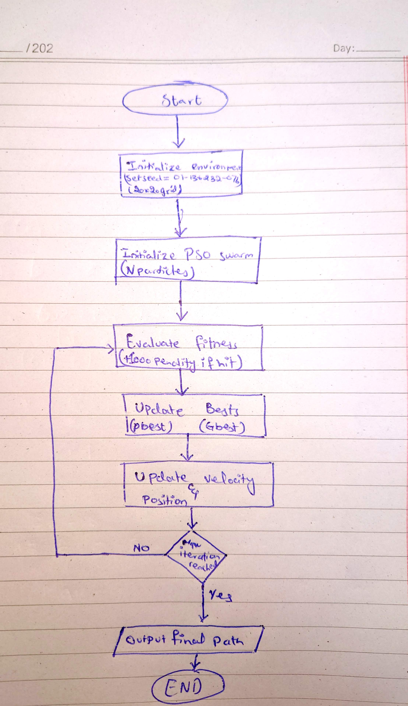

# Swarm Pathplanning: Particle Swarm Optimization

## Student Details
- **Name:** Muhammad Zohaib
- **Program:** BS Artificial Intelligence, Bahria University
- **Roll Number:** 01-136232-076
- **Random Seed Used:** 01-136232-076 (Parsed as integer: 01136232076)

## Problem Description
This repository implements a 2D grid-based pathfinding solution using **Particle Swarm Optimization (PSO)**. 
To ensure a unique problem instance, the grid environment (including obstacles, start node, and goal node) is generated dynamically using a random seed based strictly on my enrollment number.

## Algorithm Approach
In this continuous PSO implementation:
1. **Particle Representation:** Each particle represents a potential path, encoded as an array of intermediate `(x, y)` waypoints between the Start and Goal.
2. **Fitness Function:** The fitness of a path is evaluated by its total Euclidean length. 
3. **Collision Avoidance:** Bresenham's Line Algorithm traces segments between waypoints. If a segment hits an obstacle, a massive penalty (+1000) is added to the fitness, forcing the swarm to evolve toward obstacle-free paths.
4. **Update Rule:** Particles update velocities and positions iteratively, converging toward their personal best (`pbest`) and the swarm's global best (`gbest`) path.

## How to Run the Code
1. Ensure Python is installed with the required libraries:
   ```bash
   pip install numpy matplotlib

   ## Flow Diagram
